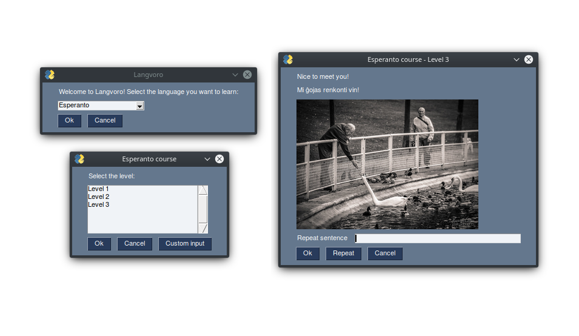

Langvoro is a project designed to ultimately provide a free of charge (and free of accounts) alternative to popular online language courses and applications.
It is an application that provides interactive "cards" where the user needs to memorize sentences, write them down and eventually use the newly learned words and sentences unassisted.
It uses the Google Translate API to translate basic vocabulary (in English by default as it is handled better by GT), as well as its TTS technology to provide voices. I also scrapes images from Google or Flickr, so it's not necessary to provide an image for each new word or sentence added.
The courses will be structured in cards, where the user will have access to audiovisual content, and will need to write down the sentences in order to improve reading, writing and listening skills at the same time. A better way to define it, the goal is to become an "Anki on steroids".
It also provides transliteration to some text, such as Cyrillic, Japanese text (Kanji, Hiragana and Katakana), Chinese text and Korean text (Hangul).
It's still very WIP, and as of the last commit, all of it was done in a single day.

#### Requirements/dependencies

- Python 3
- PySimpleGUI
- gtts
- googletrans
- playsound
- unidecode
- google_images_download
- Image / PIL
- transliterate
- pykakasi
- hangul_romanize
- flickrapi
- urllib.request

#### Languages supported

All of them, as long as it works on Google Translate =P

#### Roadmap

- Actually provide a structure for the courses (how each section/step/phase will work in terms of learning and comprehension). For example, there could be a section where the user would be provided machine generated random sentences/situations where he/she would need to use the acquired language skills in order to give a proper reply, and the software would then decide it as accurate or not.
- Provide support for Speech to Text (using a suitable API) where the user would have to speak the sentences on top of listening and writing it. The API would recognize the sentences and the program would judge their accuracy.
- Add some minor machine learning functions where it's needed or fit
- Add gamification (scores, give benefits to those who makes less mistakes)
- Add support for dictionary, where the user would be provided a definition for each word he/she clicks.
- Support to train/drawn alphabetic characters to non-latin alphabets
- Add every single basic words between languages to the database
- Add an option to download the entire course for offline usage
- Port it to Android, or even make a web interface
- Provide phonetic references (IPA)
- Actually respect good design guidelines and make it entirely Object-oriented 
